```mermaid
graph TB
    %% Main Application Structure
    subgraph "Next.js App Router"
        subgraph "(public) Routes"
            LP[Landing Page<br/>page.tsx]
            LoginP[Login Page<br/>login/page.tsx]
            SignupP[Signup Page<br/>signup/page.tsx]
        end

        subgraph "(auth) Routes"
            AuthL[Auth Layout<br/>layout.tsx]
            DashboardP[Dashboard<br/>dashboard/page.tsx]
            AssessmentsP[Assessments<br/>assessments/page.tsx]
            ProfileP[Profile<br/>profile/page.tsx]
            SessionP[Session<br/>session/page.tsx]
        end

        RootL[Root Layout<br/>layout.tsx]
    end

    %% Core Components Layer
    subgraph "Core Components"
        subgraph "Layout Components"
            AuthProvider[AuthProvider<br/>Auth State Mgmt]
            ColorThemeP[ColorThemeProvider<br/>Theme Management]
            GlobalErrorB[GlobalErrorBoundary<br/>Error Handling]
            AuthenticatedL[AuthenticatedLayout<br/>Protected UI]
        end

        subgraph "Feature Components"
            AssessmentF[AssessmentFlow<br/>Assessment UX]
            AssessmentQ[AssessmentQuestion<br/>Question Display]
            AssessmentR[AssessmentResults<br/>Results Display]
            DashboardC[Dashboard<br/>Main Dashboard]
            ModernSessionS[ModernSessionScreen<br/>Chat Interface]
        end

        subgraph "UI Components"
            Navigation[Navigation<br/>App Navigation]
            BackButton[BackButton<br/>Navigation Helper]
            LoadingSpinner[LoadingSpinner<br/>Loading States]
            SkeletonC[Skeleton Components<br/>Loading Skeletons]
        end
    end

    %% Service Layer
    subgraph "Service Layer"
        subgraph "Flow Management"
            FlowManager[FlowManager<br/>Orchestrates 5 Critical Flows]
        end

        subgraph "Unified Services"
            AssessmentM[AssessmentManager<br/>Assessment Operations]
            AssessmentP[AssessmentProcessor<br/>Result Processing]
            ChatService[ChatService<br/>Chat & Conversation]
        end

        subgraph "Infrastructure"
            SupabaseC[Supabase Client<br/>Singleton Instance]
            ErrorLogger[ErrorLogger<br/>Error Tracking]
            PerformanceU[Performance Utils<br/>Optimization Tools]
        end
    end

    %% State Management
    subgraph "State Management (Zustand)"
        AuthStore[authStore<br/>Authentication State]
        AssessmentStore[assessmentStore<br/>Assessment Data]
        ChatStore[chatStore<br/>Chat Sessions]
        ProfileStore[profileStore<br/>User Profile]
        StoreHooks[useStores Hooks<br/>Convenient Access]
    end

    %% Data Layer
    subgraph "Data Layer"
        subgraph "Database Tables"
            ProfilesT[profiles<br/>User Profiles]
            AssessmentResultsT[assessment_results<br/>Assessment Data]
            UserAssessmentProfilesT[user_assessment_profiles<br/>Processed Profiles]
            ConversationProgressT[conversation_progress<br/>Chat Analytics]
            MoodEntriesT[mood_entries<br/>Mood Tracking]
        end

        subgraph "Type Definitions"
            DatabaseT[database.ts<br/>Supabase Types]
            IndexT[index.ts<br/>Custom Types]
            AssessmentsD[assessments.ts<br/>Assessment Config]
        end
    end

    %% Relationships
    RootL --> ColorThemeP
    RootL --> GlobalErrorB
    ColorThemeP --> AuthenticatedL
    AuthenticatedL --> AuthProvider
    AuthProvider --> AuthL

    AuthL --> DashboardP
    AuthL --> AssessmentsP
    AuthL --> ProfileP
    AuthL --> SessionP

    AuthProvider --> FlowManager
    FlowManager --> AssessmentM
    FlowManager --> ChatService
    AssessmentM --> AssessmentP

    AssessmentF --> AssessmentM
    AssessmentF --> AssessmentStore
    ModernSessionS --> ChatService
    ModernSessionS --> ChatStore

    FlowManager --> AuthStore
    FlowManager --> AssessmentStore
    FlowManager --> ChatStore
    FlowManager --> ProfileStore

    AssessmentM --> SupabaseC
    ChatService --> SupabaseC
    AuthProvider --> SupabaseC

    SupabaseC --> ProfilesT
    SupabaseC --> AssessmentResultsT
    SupabaseC --> UserAssessmentProfilesT
    SupabaseC --> ConversationProgressT
    SupabaseC --> MoodEntriesT

    AuthStore --> StoreHooks
    AssessmentStore --> StoreHooks
    ChatStore --> StoreHooks
    ProfileStore --> StoreHooks

    ErrorLogger --> GlobalErrorB
    PerformanceU --> AssessmentF
    PerformanceU --> ModernSessionS

    DatabaseT --> SupabaseC
    IndexT --> AssessmentM
    AssessmentsD --> AssessmentF

    %% Styling
    classDef primary fill:#e1f5fe,stroke:#01579b,stroke-width:2px
    classDef secondary fill:#f3e5f5,stroke:#4a148c,stroke-width:2px
    classDef tertiary fill:#e8f5e8,stroke:#1b5e20,stroke-width:2px
    classDef infrastructure fill:#fff3e0,stroke:#e65100,stroke-width:2px

    class RootL,LP,LoginP,SignupP,AuthL,DashboardP,AssessmentsP,ProfileP,SessionP primary
    class AuthProvider,ColorThemeP,GlobalErrorB,AuthenticatedL,Navigation,BackButton,LoadingSpinner secondary
    class AssessmentF,AssessmentQ,AssessmentR,DashboardC,ModernSessionS,SkeletonC tertiary
    class FlowManager,AssessmentM,AssessmentP,ChatService,SupabaseC,ErrorLogger,PerformanceU infrastructure
    class AuthStore,AssessmentStore,ChatStore,ProfileStore,StoreHooks infrastructure
    class ProfilesT,AssessmentResultsT,UserAssessmentProfilesT,ConversationProgressT,MoodEntriesT,DatabaseT,IndexT,AssessmentsD infrastructure
```

## Emotion Economy - Refactored Architecture

### 🏗️ **Architectural Overview**

This diagram represents the **production-ready architecture** after comprehensive refactoring, implementing:

- ✅ **Pure App Router** navigation (no hybrid SPA conflicts)
- ✅ **Centralized Services** (no duplicated functionality)
- ✅ **Unified State Management** (Zustand stores)
- ✅ **5 Optimized User Flows** (production-ready)
- ✅ **Comprehensive Error Handling** (boundaries & logging)
- ✅ **Performance Optimizations** (memoization, virtualization)

### 🔄 **Critical User Flows (Optimized)**

1. **🔐 Login Flow**: `AuthProvider → FlowManager → AuthStore`
2. **🚪 Logout Flow**: `FlowManager → Store Cleanup → Session Clear`
3. **📋 Assessment Flow**: `AssessmentFlow → FlowManager → AssessmentManager`
4. **💬 Chat Flow**: `ModernSessionScreen → FlowManager → ChatService`
5. **🎯 Assessment-Enhanced Chat**: `Dynamic Context Updates → Personalized Responses`

### 📊 **Key Architectural Improvements**

#### **Before Refactoring:**
- ❌ Hybrid SPA/App Router conflicts
- ❌ 4 fragmented assessment services
- ❌ Duplicate Supabase clients
- ❌ Scattered state management
- ❌ No error boundaries
- ❌ Dead code and unused tables

#### **After Refactoring:**
- ✅ **Pure App Router** with route groups
- ✅ **Unified AssessmentManager** service
- ✅ **Singleton Supabase** client
- ✅ **Centralized Zustand** stores
- ✅ **Global Error Boundary** with logging
- ✅ **Clean database** (removed unused tables)

### 🗂️ **Component Relationships**

#### **Data Flow:**
```
User Action → Component → FlowManager → Service → Store → Database
```

#### **State Management:**
```
Components → useStores Hooks → Zustand Stores → Persistence
```

#### **Error Handling:**
```
Error → GlobalErrorBoundary → ErrorLogger → External Service
```

#### **Performance:**
```
Components → Performance Utils → Memoization/Virtualization → Monitoring
```

### 🎯 **Production Readiness**

- **Scalable Architecture**: Service-oriented design
- **Error Resilient**: Comprehensive error boundaries & logging
- **Performance Optimized**: Memoization, virtualization, lazy loading
- **Type Safe**: Full TypeScript coverage with Supabase types
- **Maintainable**: Clean separation of concerns
- **Test Ready**: Modular components and services

This architecture eliminates all critical issues identified in the audit and provides a solid foundation for production deployment with the 5 optimized user flows.
