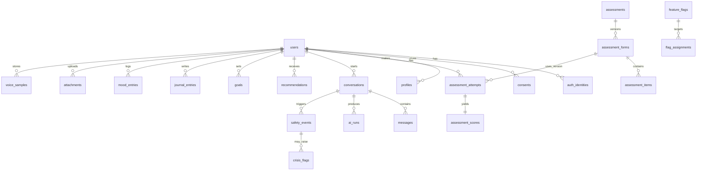

## Comprehensive Mental Health Platform - Entity Relationship Diagram

### 📊 **Core Entities Overview**

#### **🔐 User Management**
- **`users`** - Primary user accounts
- **`auth_identities`** - OAuth/external authentication identities
- **`consents`** - User consent records for data usage
- **`profiles`** - Extended user profile information

#### **📋 Assessment System**
- **`assessments`** - Assessment definitions/templates
- **`assessment_forms`** - Versioned assessment forms
- **`assessment_items`** - Individual questions/items
- **`assessment_attempts`** - User assessment sessions
- **`assessment_scores`** - Calculated results/scores

#### **💬 Conversation & AI System**
- **`conversations`** - Chat/conversation sessions
- **`messages`** - Individual messages in conversations
- **`ai_runs`** - AI processing sessions/responses
- **`safety_events`** - Safety monitoring events
- **`crisis_flags`** - Crisis detection flags

#### **🎯 Personal Development**
- **`recommendations`** - AI/personalized recommendations
- **`goals`** - User-set goals and objectives
- **`journal_entries`** - User journal/reflection entries
- **`mood_entries`** - Mood tracking data

#### **🛡️ Safety & Monitoring**
- **`safety_events`** - Safety-related events
- **`crisis_flags`** - Crisis detection flags

#### **⚙️ Feature Management**
- **`feature_flags`** - Feature toggles/configuration
- **`flag_assignments`** - User/feature flag assignments

#### **📎 Media & Attachments**
- **`attachments`** - File/media attachments
- **`voice_samples`** - Voice recording samples

### 🔗 **Key Relationships**

#### **One-to-Many Relationships:**
- `users ||--o{ auth_identities` - Users can have multiple auth identities
- `users ||--o{ consents` - Users give multiple consents over time
- `users ||--o{ assessment_attempts` - Users take multiple assessments
- `users ||--o{ conversations` - Users start multiple conversations
- `conversations ||--o{ messages` - Conversations contain multiple messages
- `conversations ||--o{ ai_runs` - Conversations produce multiple AI responses
- `users ||--o{ mood_entries` - Users log multiple mood entries

#### **One-to-One Relationships:**
- `assessment_attempts ||--|| assessment_scores` - Each attempt yields one score

#### **Versioning & Configuration:**
- `assessments ||--o{ assessment_forms` - Assessments have multiple versions
- `assessment_forms ||--o{ assessment_items` - Forms contain multiple items
- `feature_flags ||--o{ flag_assignments` - Flags target multiple assignments

### 🏗️ **Architecture Benefits**

#### **Scalability:**
- Normalized structure allows for easy expansion
- Versioned assessments support iterative improvements
- Flexible consent management for compliance

#### **Safety & Monitoring:**
- Comprehensive safety event tracking
- Crisis flag system for immediate intervention
- Audit trail through multiple relationship paths

#### **Personalization:**
- Rich user profiling through multiple data sources
- AI-driven recommendations based on conversation history
- Goal tracking and progress monitoring

#### **Compliance:**
- Detailed consent tracking
- Comprehensive audit trails
- Data retention and privacy controls

### 📈 **Data Flow Patterns**

#### **Assessment Flow:**
```
users → assessment_attempts → assessment_scores → recommendations
```

#### **Conversation Flow:**
```
users → conversations → messages → ai_runs → safety_events
```

#### **Personal Development Flow:**
```
users → goals → journal_entries → mood_entries → recommendations
```

#### **Safety Monitoring Flow:**
```
conversations → safety_events → crisis_flags → interventions
```

### 🎯 **Production Considerations**

#### **Indexing Strategy:**
- Primary keys on all entities
- Foreign key indexes for performance
- Composite indexes on frequently queried relationships
- Time-based indexes on temporal data (mood_entries, messages)

#### **Partitioning Strategy:**
- Time-based partitioning for `mood_entries`, `messages`, `ai_runs`
- User-based partitioning for large user datasets
- Archive strategy for historical data

#### **Security Considerations:**
- Row Level Security (RLS) on user-sensitive tables
- Encrypted storage for sensitive assessment data
- Audit logging for safety events and consent changes
- API rate limiting and abuse detection

This ER diagram represents a comprehensive mental health platform that can scale to support thousands of users while maintaining data integrity, privacy compliance, and real-time safety monitoring.
