```mermaid
erDiagram
    %% User Management & Authentication
    users {
        uuid id PK
        string email UK
        string username UK
        timestamp created_at
        timestamp updated_at
        boolean is_active
    }

    auth_identities {
        uuid id PK
        uuid user_id FK
        string provider
        string provider_id UK
        json provider_data
        timestamp created_at
    }

    consents {
        uuid id PK
        uuid user_id FK
        string consent_type
        text consent_text
        boolean granted
        timestamp granted_at
        timestamp expires_at
        timestamp created_at
    }

    profiles {
        uuid id PK
        uuid user_id FK
        string display_name
        text bio
        json preferences
        json metadata
        timestamp created_at
        timestamp updated_at
    }

    %% Assessment System
    assessments {
        uuid id PK
        string name
        string description
        string category
        boolean is_active
        timestamp created_at
        timestamp updated_at
    }

    assessment_forms {
        uuid id PK
        uuid assessment_id FK
        integer version
        string title
        text instructions
        boolean is_active
        timestamp created_at
        timestamp updated_at
    }

    assessment_items {
        uuid id PK
        uuid form_id FK
        integer order_index
        string question_type
        text question_text
        json options
        json validation_rules
        boolean is_required
        timestamp created_at
    }

    assessment_attempts {
        uuid id PK
        uuid user_id FK
        uuid form_id FK
        json responses
        string status "pending|completed|expired"
        timestamp started_at
        timestamp completed_at
        timestamp created_at
        timestamp updated_at
    }

    assessment_scores {
        uuid id PK
        uuid attempt_id FK
        string score_type
        decimal score_value
        json score_data
        text interpretation
        timestamp calculated_at
        timestamp created_at
    }

    %% Conversation & AI System
    conversations {
        uuid id PK
        uuid user_id FK
        string title
        string status "active|completed|archived"
        timestamp started_at
        timestamp last_activity
        json metadata
        timestamp created_at
        timestamp updated_at
    }

    messages {
        uuid id PK
        uuid conversation_id FK
        string role "user|assistant|system"
        text content
        json metadata
        timestamp created_at
    }

    ai_runs {
        uuid id PK
        uuid conversation_id FK
        uuid message_id FK
        string model_name
        json prompt_data
        json response_data
        decimal tokens_used
        decimal response_time
        timestamp created_at
    }

    safety_events {
        uuid id PK
        uuid conversation_id FK
        uuid message_id FK
        string event_type
        json event_data
        string severity "low|medium|high|critical"
        boolean reviewed
        timestamp created_at
    }

    crisis_flags {
        uuid id PK
        uuid safety_event_id FK
        string flag_type
        string priority "low|medium|high|urgent"
        boolean resolved
        uuid resolved_by
        timestamp resolved_at
        timestamp created_at
    }

    %% Personal Development
    recommendations {
        uuid id PK
        uuid user_id FK
        string recommendation_type
        text content
        json metadata
        string status "pending|delivered|read|actioned"
        timestamp delivered_at
        timestamp created_at
    }

    goals {
        uuid id PK
        uuid user_id FK
        string title
        text description
        string category
        string status "active|completed|paused|cancelled"
        date target_date
        json progress_data
        timestamp created_at
        timestamp updated_at
    }

    journal_entries {
        uuid id PK
        uuid user_id FK
        string title
        text content
        json mood_data
        json tags
        boolean is_private
        timestamp entry_date
        timestamp created_at
        timestamp updated_at
    }

    mood_entries {
        uuid id PK
        uuid user_id FK
        integer mood_score
        string mood_label
        json context_data
        timestamp entry_timestamp
        timestamp created_at
    }

    %% Feature Management
    feature_flags {
        uuid id PK
        string name UK
        string description
        boolean is_enabled
        json conditions
        timestamp created_at
        timestamp updated_at
    }

    flag_assignments {
        uuid id PK
        uuid flag_id FK
        string target_type "user|group|global"
        uuid target_id
        boolean is_enabled
        json override_value
        timestamp created_at
        timestamp updated_at
    }

    %% Audit & Compliance
    audit_logs {
        uuid id PK
        uuid user_id FK
        string action
        string resource_type
        uuid resource_id
        json old_values
        json new_values
        string ip_address
        string user_agent
        timestamp created_at
    }

    %% Relationships with FK labels
    users ||--o{ auth_identities : "auth_identities.user_id → users.id"
    users ||--o{ consents : "consents.user_id → users.id"
    users ||--|| profiles : "profiles.user_id → users.id (1:1)"

    assessments ||--o{ assessment_forms : "assessment_forms.assessment_id → assessments.id"
    assessment_forms ||--o{ assessment_items : "assessment_items.form_id → assessment_forms.id"

    users ||--o{ assessment_attempts : "assessment_attempts.user_id → users.id"
    assessment_forms ||--o{ assessment_attempts : "assessment_attempts.form_id → assessment_forms.id"
    assessment_attempts ||--|| assessment_scores : "assessment_scores.attempt_id → assessment_attempts.id"

    users ||--o{ conversations : "conversations.user_id → users.id"
    conversations ||--o{ messages : "messages.conversation_id → conversations.id"
    conversations ||--o{ ai_runs : "ai_runs.conversation_id → conversations.id"
    conversations ||--o{ safety_events : "safety_events.conversation_id → conversations.id"
    messages ||--o{ ai_runs : "ai_runs.message_id → messages.id"
    messages ||--o{ safety_events : "safety_events.message_id → messages.id"
    safety_events ||--|| crisis_flags : "crisis_flags.safety_event_id → safety_events.id"

    users ||--o{ recommendations : "recommendations.user_id → users.id"
    users ||--o{ goals : "goals.user_id → users.id"
    users ||--o{ journal_entries : "journal_entries.user_id → users.id"
    users ||--o{ mood_entries : "mood_entries.user_id → users.id"

    feature_flags ||--o{ flag_assignments : "flag_assignments.flag_id → feature_flags.id"

    users ||--o{ audit_logs : "audit_logs.user_id → users.id"
```

## 🗂️ **Entity Relationship Diagram - Detailed Schema**

### 📊 **Entity Overview**

#### **👤 User Management (User-Scoped)**
- **`users`** - Core user accounts with authentication
- **`auth_identities`** - OAuth/external authentication providers
- **`consents`** - GDPR/privacy consent management
- **`profiles`** - Extended user profile data (1:1 with users)

#### **📋 Assessment System (Mixed Scope)**
- **`assessments`** - Assessment templates/definitions
- **`assessment_forms`** - Versioned assessment forms
- **`assessment_items`** - Individual questions/items
- **`assessment_attempts`** - User assessment sessions
- **`assessment_scores`** - Calculated assessment results

#### **💬 Conversation & AI (User-Scoped)**
- **`conversations`** - Chat/conversation sessions
- **`messages`** - Individual messages
- **`ai_runs`** - AI processing sessions
- **`safety_events`** - Safety monitoring events
- **`crisis_flags`** - Crisis detection and response

#### **🎯 Personal Development (User-Scoped)**
- **`recommendations`** - AI/personalized recommendations
- **`goals`** - User-set goals and objectives
- **`journal_entries`** - User reflection/journal entries
- **`mood_entries`** - Mood tracking data

#### **⚙️ Feature Management (Global)**
- **`feature_flags`** - Feature toggles/configuration
- **`flag_assignments`** - User/feature flag assignments

#### **📋 Audit & Compliance (Global)**
- **`audit_logs`** - Comprehensive audit trail

### 🔗 **Key Relationships & Foreign Keys**

#### **User Management:**
```
users.id ← auth_identities.user_id
users.id ← consents.user_id
users.id ← profiles.user_id (1:1)
```

#### **Assessment Flow:**
```
assessments.id ← assessment_forms.assessment_id
assessment_forms.id ← assessment_items.form_id
users.id ← assessment_attempts.user_id
assessment_forms.id ← assessment_attempts.form_id
assessment_attempts.id ← assessment_scores.attempt_id
```

#### **Conversation Flow:**
```
users.id ← conversations.user_id
conversations.id ← messages.conversation_id
conversations.id ← ai_runs.conversation_id
conversations.id ← safety_events.conversation_id
messages.id ← ai_runs.message_id
messages.id ← safety_events.message_id
safety_events.id ← crisis_flags.safety_event_id
```

#### **Personal Development:**
```
users.id ← recommendations.user_id
users.id ← goals.user_id
users.id ← journal_entries.user_id
users.id ← mood_entries.user_id
```

#### **Feature Management:**
```
feature_flags.id ← flag_assignments.flag_id
users.id ← audit_logs.user_id
```

### 🏷️ **Legend: Table Scope Classification**

#### **🔵 User-Scoped Tables (Partition by User)**
- `auth_identities`, `consents`, `profiles`
- `assessment_attempts`, `assessment_scores`
- `conversations`, `messages`, `ai_runs`, `safety_events`, `crisis_flags`
- `recommendations`, `goals`, `journal_entries`, `mood_entries`
- `audit_logs` (user-scoped for compliance)

#### **🟡 Global Tables (System-wide)**
- `users` (global user registry)
- `assessments`, `assessment_forms`, `assessment_items`
- `feature_flags`, `flag_assignments`

### 🏗️ **Database Design Principles**

#### **Normalization:**
- **1NF**: All tables have atomic values
- **2NF**: No partial dependencies on composite keys
- **3NF**: No transitive dependencies
- **BCNF**: Every determinant is a candidate key

#### **Indexing Strategy:**
```sql
-- Primary Keys (auto-indexed)
-- Foreign Keys (manual indexes needed)
CREATE INDEX idx_auth_identities_user_id ON auth_identities(user_id);
CREATE INDEX idx_consents_user_id ON consents(user_id);
CREATE INDEX idx_assessment_attempts_user_id ON assessment_attempts(user_id);
CREATE INDEX idx_conversations_user_id ON conversations(user_id);
-- ... additional FK indexes

-- Performance indexes
CREATE INDEX idx_mood_entries_user_timestamp ON mood_entries(user_id, entry_timestamp);
CREATE INDEX idx_messages_conversation_created ON messages(conversation_id, created_at);
CREATE INDEX idx_audit_logs_user_created ON audit_logs(user_id, created_at);
```

#### **Partitioning Strategy:**
```sql
-- User-scoped tables: Partition by user_id
-- Time-series tables: Partition by date ranges
ALTER TABLE mood_entries PARTITION BY RANGE (entry_timestamp);
ALTER TABLE messages PARTITION BY RANGE (created_at);
ALTER TABLE audit_logs PARTITION BY RANGE (created_at);
```

### 🔒 **Security & Compliance**

#### **Row Level Security (RLS):**
- Users can only access their own data
- Admins have appropriate elevated access
- Audit logs maintain full access trails

#### **Data Encryption:**
- Sensitive fields encrypted at rest
- PII data properly masked in logs
- Secure key management for encryption

#### **Backup & Recovery:**
- Point-in-time recovery capability
- Encrypted backups with access controls
- Disaster recovery procedures documented

This detailed ER diagram provides a comprehensive view of the mental health platform's data architecture, with proper relationships, constraints, and scalability considerations for production deployment.
